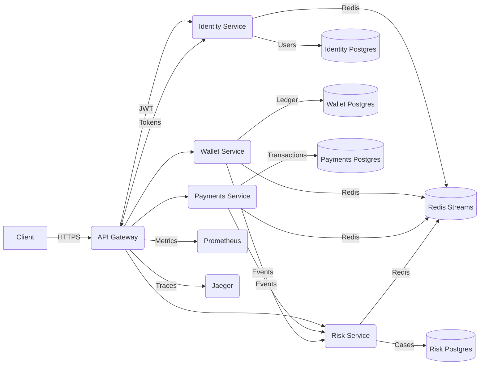

# High-Level Architecture

```mermaid
flowchart LR
    Client -->|HTTPS| APIGW(API Gateway)
    APIGW -->|JWT| ID(Identity Service)
    APIGW --> WAL(Wallet Service)
    APIGW --> PAY(Payments Service)
    APIGW --> RISK(Risk Service)
    PAY -->|Events| RISK
    WAL -->|Events| RISK
    ID <-->|Tokens| APIGW
    ID -->|Users| IDDB[(Identity Postgres)]
    WAL -->|Ledger| WALDB[(Wallet Postgres)]
    PAY -->|Transactions| PAYDB[(Payments Postgres)]
    RISK -->|Cases| RISKDB[(Risk Postgres)]
    APIGW -->|Metrics| PROM(Prometheus)
    APIGW -->|Traces| JAEGER(Jaeger)
    ID -->|Redis| REDIS[(Redis Streams)]
    WAL -->|Redis| REDIS
    PAY -->|Redis| REDIS
    RISK -->|Redis| REDIS
```
