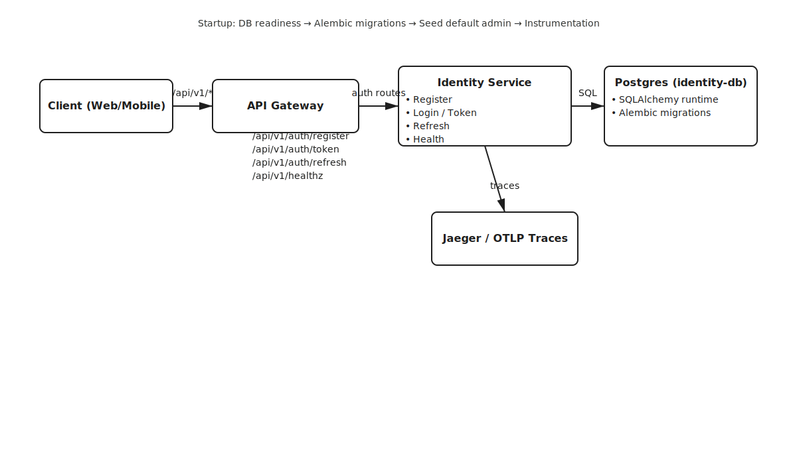

# Identity Service — API Overview

- Source of truth for user identities and authentication
- Issues access/refresh JWTs with claims used by other services
- Auto-migrates DB and seeds default admin on startup

---

## Architecture at a glance



- Client → API Gateway → Identity → Postgres
- OpenTelemetry traces to Jaeger
- Startup: DB readiness → Alembic → Seed → Instrumentation

---

## Endpoints (summary)

Base path: `/api/v1`

- GET `/healthz` — liveness/readiness
- POST `/auth/register` — create user
- POST `/auth/token` — login, get tokens
- POST `/auth/refresh` — exchange refresh token
- GET `/auth/me` — current user
- POST `/auth/verification/*` — request & confirm
- POST `/auth/password-reset/*` — request & confirm

---

## Health — GET /api/v1/healthz

Request: none

Response 200:
```json
{ "status": "ok", "service": "identity-service" }
```

---

## Register — POST /api/v1/auth/register

Request body:
```json
{
  "email": "user@example.com",
  "password": "StrongPassword123!"
}
```

Response 201:
```json
{
  "id": 1,
  "email": "user@example.com",
  "is_active": true,
  "is_verified": false,
  "roles": "customer",
  "created_at": "2025-10-30T12:34:56Z",
  "updated_at": "2025-10-30T12:34:56Z"
}
```

Error 409:
```json
{ "detail": "User already exists" }
```

---

## Token — POST /api/v1/auth/token

Request body:
```json
{
  "email": "user@example.com",
  "password": "StrongPassword123!"
}
```

Response 200:
```json
{
  "access_token": "<JWT>",
  "refresh_token": "<JWT>",
  "token_type": "bearer",
  "expires_in": 900
}
```

Error 401:
```json
{ "detail": "Invalid credentials" }
```

Policy 403s:
```json
{ "detail": "Account locked. Try again later." }
{ "detail": "User account is inactive" }
{ "detail": "Email not verified" }
```

---

## Refresh — POST /api/v1/auth/refresh

Request body:
```json
{ "refresh_token": "<JWT>" }
```

Response 200:
```json
{
  "access_token": "<JWT>",
  "refresh_token": "<JWT>",
  "token_type": "bearer",
  "expires_in": 900
}
```

Errors 401:
```json
{ "detail": "Invalid refresh token" }
```
```json
{ "detail": "Invalid token scope" }
```

---

## Me — GET /api/v1/auth/me

Headers:
```
Authorization: Bearer <access_jwt>
```
Response 200: UserResponse (same as Register)
Errors: 401 invalid/missing token or wrong scope

---

## Verification — request & confirm

Request token:
```
POST /api/v1/auth/verification/request
{ "email": "user@example.com" }
```
Response 202:
```
{ "verification_token": "<token>" }
```

Confirm:
```
POST /api/v1/auth/verification/confirm
{ "token": "<token>" }
```
Response 200: UserResponse (is_verified true)

---

## Password reset — request & confirm

Request token:
```
POST /api/v1/auth/password-reset/request
{ "email": "user@example.com" }
```
Response 202:
```
{ "password_reset_token": "<token>" }
```

Confirm new password:
```
POST /api/v1/auth/password-reset/confirm
{ "token": "<token>", "new_password": "StrongerPass123!" }
```
Response 204: password updated; lockout counters cleared

---

## JWT claims (HS256)

Issued by `core/security.create_token`:
```json
{
  "sub": "<user_id>",
  "scope": "access|refresh",
  "iss": "http://identity-service:8000",
  "aud": "fintech-platform",
  "iat": 1698662400,
  "exp": 1698663300,
  "typ": "access|refresh"
}
```

- Access TTL: 15m (default)
- Refresh TTL: 24h (default)

---

## Startup & migrations

- DB readiness check (asyncpg)
- Alembic migrations (psycopg sync URL)
- Seed default admin (idempotent)
- OpenTelemetry instrumentation

---

## Observability

- FastAPI instrumentation → OTLP exporter
- Jaeger UI via docker-compose
- Structured logs via Loguru

---

## Login policy

- max_failed_login_attempts: 5
- lockout_minutes: 15
- require_verified_for_login: false (toggleable)
- On success: reset counters and set `last_login_at`

---

## Next steps

- Add is_active / is_verified checks to login
- Implement verification and reset flows
- MFA & account lockout policies
- Expand endpoint docs with curl examples
